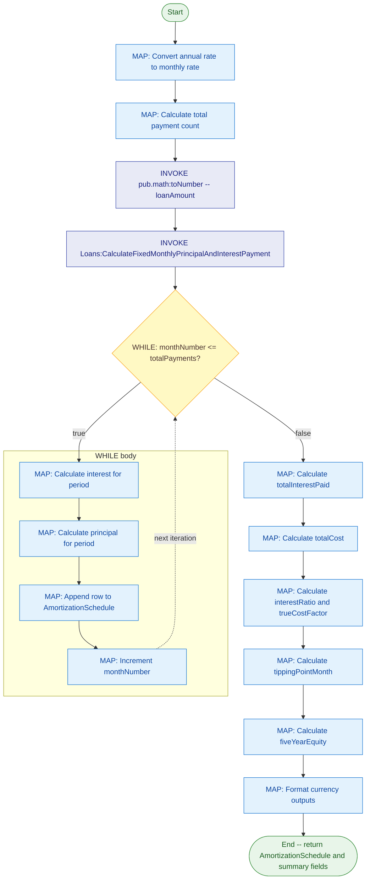

# Service Documentation Supplement

## When to Generate Documentation

Generate a `.md` companion file:
- ✅ When the user explicitly requests documentation
- ✅ When the user asks to "document", "describe", or "write docs for" a service
- ❌ NOT automatically with every FSL generation unless requested

---

## Instructions

1. Ensure the markdown file matches information in the FSL file, but format it for human legibility using organised Markdown headings, blocks, lists, and bold callouts.
2. Structure the file according to the required template below:
    - **Service Name & Interface Title**
    - **Service Purpose Description** (extracted from `properties` block `comment`, or inferred — see Deduction Rules)
    - **Inputs Table/List** (Name, Type, Constraints, and clear business descriptions)
    - **Outputs Table/List** (Name, Type, and multi-line/single-line documentation blocks)
3. **Always embed a Mermaid flowchart diagram inline** in the `## Flow Diagram` section using a fenced ` ```mermaid ` code block, unless the user explicitly asks to omit it or requests a different format (e.g. ASCII art). The diagram must accurately reflect the service's control flow — inputs, each major step (MAP, INVOKE, TRY/CATCH/FINALLY, IF/ELSEIF/ELSE, BRANCH, SWITCH, LOOP, WHILE, DO/UNTIL, REPEAT, SEQUENCE, EXIT), and outputs.

   **⚠️ All diagram authoring rules (chart type, colour palette, node shapes, section comments, ASCII arrows, subgraph patterns, ghost-node prohibition, receiver nodes, loop-back arrows, special-character escaping, edge labels, and the inline `classDef` block template) live exclusively in `supplements/service-diagramming.md`.** Before generating the inline diagram, read that file and apply every rule in its **Mermaid Authoring Rules** and **Inline Diagram** sections. That file is the single source of truth for all diagram construction — do not override or duplicate its rules here.

### Deduction & Fallback Rules

- **Missing Service Comment:** If the top-level `comment` property is omitted in the FSL `properties` block, dynamically infer the overall business purpose first from the literal service name itself, and second by analysing the sequence of internal pipeline modifications, structural mappings, or any invoked services inside the flow logic.
- **Missing Field Comments:** If any input or output field lacks an explicit inline `comment` string, deduce a clear business description based on the field's variable name, its technical data type, and how it is manipulated, checked, or transformed throughout the service logic.
- **Fallback Text:** If a field's purpose cannot be confidently inferred from its name or logic, do not leave it blank — populate the description with a professional, context-aware placeholder based on its name (e.g., "The target identifier for this operation.").

---

## Output File

- **Location:** Same folder as the `.flow` file
- **File name:** `{ServiceName}.md` (e.g., `getJoke/getJoke.md`)

---

## Required Markdown Format

The generated `.md` file MUST conform to this exact visual structure:

```markdown
# Service Documentation: {Interface}:{ServiceName}

## Purpose
{One or more sentences describing what the service does and its business purpose.}

## Service Signature

### Inputs
| Parameter | Type | Constraints | Description |
|---|---|---|---|
| `{paramName}` | `{Type}` | `{constraint}: {value}` | {Clear business description of this input parameter.} |

### Outputs
| Parameter | Type | Description |
|---|---|---|
| `{paramName}` | `{Type}` | {Clear business description of this output parameter.} |

## Flow Diagram
```mermaid
flowchart TD
    {classDef block and nodes — follow all rules in supplements/service-diagramming.md}
```

## Usage Examples

### Example 1 — {Scenario Name}
**Input:**
| Parameter | Value |
|---|---|
| `{paramName}` | `{value}` |

**Output:**
| Parameter | Value |
|---|---|
| `{paramName}` | `{value}` |

## Implementation Details
{Brief description of how the service is implemented — key steps, services invoked, logic applied.}

## Error Handling
{Description of how errors are handled — TRY/CATCH blocks, EXIT signals, failure messages.}

## Related Services
| Service | Purpose |
|---|---|
| `{namespace:service}` | {What it does in context of this service} |

## Notes
{Any additional notes, constraints, version considerations, or caveats.}
```

---

## Concrete Example — AmortizationCalculator

The following is a fully worked documentation file for the `Loans:AmortizationCalculator` service. Use it as the reference pattern for how the template sections should be populated with real service content.

```markdown
# Service Documentation: Loans:AmortizationCalculator

## Purpose
Calculates the month-by-month repayment schedule of a loan based on the principal amount, interest rate, and loan length.

## Service Signature

### Inputs
| Parameter | Type | Constraints | Description |
|---|---|---|---|
| `loanAmount` | `String` | `allowNull: false` | The total initial sum of money borrowed or the starting balance of the loan before any payments are applied. |
| `interestRate` | `String` | — | The nominal yearly interest percentage charged by the lender (which the service will dynamically convert to a monthly fractional rate for period calculations). |
| `termYears` | `String` | — | The overall lifespan of the loan expressed in years, representing the total operational horizon (which the service will translate into total installment months). |

### Outputs
| Parameter | Type | Description |
|---|---|---|
| `AmortizationSchedule` | `recordList` | For every month the loan is active, a single line item tracking: Payment Number, Payment Amount, Interest Amount, Principal Amount, Ending Balance. |
| `fixedMonthlyPayment` | `String` | The baseline regular amount the borrower must pay during each individual installment period to successfully amortize the debt. |
| `totalInterestPaid` | `String` | The cumulative cost of borrowing over the entire lifespan of the loan, representing the sum total of all interest charges. |
| `totalCost` | `String` | The absolute lifetime cost of the debt, calculated as the original loan amount plus the total interest paid. |
| `interestRatio` | `String` | A financial efficiency metric representing the percentage of the lifetime cost eaten up by interest charges rather than equity. |
| `trueCostFactor` | `String` | A strategic multiplier that compares the total lifetime cost of the loan back to the original principal amount (indicating how many times over the borrower is paying for the asset). |
| `tippingPointMonth` | `String` | The exact calendar month during the lifecycle of the loan where the monthly principal allocation permanently eclipses the monthly interest charge. |
| `fiveYearEquity` | `String` | The total principal paid down by the borrower at the exact 60-month mark, showing real asset ownership after five years. |

## Flow Diagram


## Usage Examples

### Example 1 — 30-year mortgage at 5% interest
**Input:**
| Parameter | Value |
|---|---|
| `loanAmount` | `"300000"` |
| `interestRate` | `"5"` |
| `termYears` | `"30"` |

**Output:**
| Parameter | Value |
|---|---|
| `fixedMonthlyPayment` | `"$1,610.46"` |
| `totalInterestPaid` | `"$279,767.35"` |
| `totalCost` | `"$579,767.35"` |
| `tippingPointMonth` | `"153"` |
| `fiveYearEquity` | `"$17,339.29"` |
| `AmortizationSchedule` | `recordList of 360 monthly payment rows` |

## Implementation Details
The service converts the annual interest rate to a monthly rate, calculates the total number of payments, then computes the fixed monthly payment using the standard amortization formula. A WHILE loop iterates month-by-month, computing interest and principal split per period, accumulating results into a recordList. Post-loop MAP steps calculate summary totals, financial ratios, and format all currency outputs.

## Error Handling
No explicit TRY/CATCH block. Invalid or non-numeric inputs will cause the upstream `pub.math:toNumber` TRANSFORM to fail, surfacing a service exception to the caller.

## Related Services
| Service | Purpose |
|---|---|
| `Loans:CalculateMonthlyInterestRate` | Converts the annual interest rate to a monthly fractional decimal |
| `Loans:CalculateFixedMonthlyPrincipalAndInterestPayment` | Computes the fixed monthly repayment amount |
| `pub.math:toNumber` | Converts String inputs to numeric types for calculations |
| `pub.string:numericFormat` | Formats numeric outputs as currency strings |

## Notes
- All input values are passed as `String` type per the webMethods pipeline convention.
- Currency outputs are formatted as `$#,##0.00`.
- The `tippingPointMonth` identifies when principal repayment exceeds interest — a key metric for early repayment decisions.
```

---

## Documentation Maintenance

- ✅ Update documentation when service logic changes
- ✅ Keep examples current and accurate
- ✅ Document breaking changes prominently
- ✅ Include version history notes after each significant change

---

## File Organisation

Always place generated files in a service-specific folder:

```
{ServiceName}/
    flow.flow              # The FSL service
    {ServiceName}.md       # Documentation (Mermaid diagram embedded inline by default)
    {ServiceName}.mmd      # Standalone Mermaid diagram (only if explicitly requested)
    tests/                 # Unit tests (if generated)
        {ServiceName}_TestSuite.xml
        {testName}-input.xml
        {testName}-result.xml
```

### Naming Rules
- Folder name: exact unqualified service name, camelCase (e.g. `getJoke/`)
- Documentation file: `{ServiceName}.md`
- Diagram file: `{ServiceName}.mmd` — only created when the user requests a separate diagram file
- Match case exactly with the service name in all filenames
