# Mermaid File Configuration

Each file must contain raw Mermaid syntax only, with no Markdown wrapper, no title heading, and no surrounding prose.

## Diagram Content Requirements
For each Mermaid diagram, include:
- Start and end nodes
- Input parsing or initialization nodes
- All major `MAP`, `INVOKE`, `TRANSFORM`, loop, and branch structures
- Labels that reflect the actual generated service logic
- Distinct styling classes for map nodes, invoke/transform nodes, loop nodes, and branch nodes

## Formatting Constraints
1. Use raw Mermaid syntax only.
2. Do not include Markdown code fences, headings, or explanatory prose.
3. Apply structural color themes to distinct FSL components (for example: map nodes blue, invoke/transform nodes orange, loop structures purple, and conditional branches red).
4. Ensure each diagram reflects the generated FSL structure, not a generic summary.
5. Add `%% Section Name` comments immediately before each logical group of nodes (e.g., `%% Styling`, `%% Start and Inputs`, `%% Step 1: ...`). These are mandatory, not decorative — they serve as human-readable navigation markers in the raw file.
6. **No unused classDef declarations.** Only declare a `classDef` for a node class that has at least one node applying it via `:::className`. If a class exists in the example but no node in your generated diagram uses it, omit it entirely.

## Mermaid.js Diagram Guidelines:
- Use Mermaid.js flowchart syntax with `graph TD` (top-down) or `graph LR` (left-right) as appropriate
- Use clear, descriptive node labels
- Include error paths and conditional branches
- Keep diagrams readable - don't overcomplicate
- Use appropriate node shapes:
  - `{{Start}}` - Hexagon for start node (use bright green fill: `style Start fill:#00FF00`)
  - `[End]` - Square for end node (use red fill: `style End fill:#FF0000`)
  - `[/Inputs: param1, param2/]` - Parallelogram (trapezoid right) for input parameters - use "Inputs:" label
  - `[\Outputs: result1, result2\]` - Parallelogram (trapezoid left) for output parameters - use "Outputs:" label
  - `[Process]` - Rectangle for processing steps (e.g., INVOKE, single operations)
  - `["MAP ━━━━━━ set var = 'value' set var2 = 'value2'"]` - Rectangle with line breaks for MAP blocks showing multiple set statements (use lavender fill: `style MapNode fill:#E6E6FA`)
  - `(Rounded)` - Rounded rectangle for service calls or transformations
  - `{Decision}` - Diamond for conditional logic (TRY, BRANCH, IF, etc.)
  - `[[Service Call]]` - Subroutine shape for INVOKE steps
  - `[(Database)]` - Cylinder for data operations
- **MAP Block Representation**: When showing MAP steps with multiple set statements, use a single rectangle node with:
  - "MAP" as the header
  - A separator line (━━━━━━)
  - Each set statement on its own line using ` ` for line breaks
  - Lavender fill color (#E6E6FA) to distinguish from other process nodes
- Label edges clearly for branching logic: `success`, `error`, `true`, `false`, `default`
- **CRITICAL - Escape Special Characters in Node Labels**: When Mermaid node text contains reserved characters, escape them using HTML entities to avoid parse/render errors.
  - Curly braces: `{` -> `&#123;`, `}` -> `&#125;`
  - Square brackets in literal text: `[` -> `&#91;`, `]` -> `&#93;`
  - Use this especially for REST paths like `/customers/{customerNumber}` inside node labels.
  - Example (correct): `HttpInvoke[[INVOKE pub.client:http GET /customers/&#123;customerNumber&#125;]]`
  - Example (correct): `PaymentsInvoke[[INVOKE pub.client:http GET /customers/&#123;customerNumber&#125;/payments]]`
- Group related steps using subgraphs when appropriate
- Use consistent styling and colors for different types of operations:
  - Start node: Bright green (#00FF00) with black text
  - End node: Red (#FF0000) with white text
  - INVOKE nodes: Light blue (#87CEEB) with black text
  - MAP nodes: Lavender (#E6E6FA) with black text
  - TRY blocks: Gold (#FFD700) with black text
  - CATCH blocks: Orange (#FFA500) with black text
  - Error paths: Red or orange
  - Success paths: Green
- **Text Color Rule**: Use `color:#000` (black) for light-colored nodes, `color:#FFF` (white) for dark-colored nodes

## Mandatory Output Template

The example below defines the **required structural pattern** for all generated diagrams. Every output file must conform to this pattern — including `%%` section markers, `classDef` declarations for all used node types, node shape syntax, and edge label casing. Treat it as a template, not an illustration.

```mermaid
graph TD
    %% Styling
    classDef startNode fill:#00FF00,stroke:#006400,stroke-width:3px,color:#000;
    classDef endNode fill:#FF0000,stroke:#8B0000,stroke-width:3px,color:#FFF;
    classDef inputNode fill:#E0F7FA,stroke:#0097A7,stroke-width:2px,color:#000;
    classDef outputNode fill:#F3E5F5,stroke:#7B1FA2,stroke-width:2px,color:#000;
    classDef invokeNode fill:#87CEEB,stroke:#4682B4,stroke-width:2px,color:#000;
    classDef mapNode fill:#E6E6FA,stroke:#9370DB,stroke-width:2px,color:#000;
    classDef loopNode fill:#DDA0DD,stroke:#8B008B,stroke-width:3px,color:#000;
    classDef branchNode fill:#FFB6C1,stroke:#DC143C,stroke-width:2px,color:#000;
    classDef transformNode fill:#FFE4B5,stroke:#FF8C00,stroke-width:2px,color:#000;

    %% Start and Inputs
    Start{{Start: AmortizationCalculator}}:::startNode
    Inputs[/Inputs:<br/>loanAmount, interestRate, termYears/]:::inputNode
    
    Start --> Inputs
    Inputs --> Map1

    %% Step 1: Input Validation
    Map1["MAP: Validate Inputs<br/>━━━━━━━━━━━━━━━━━━<br/>TRANSFORM pub.math:toNumber<br/>loanAmount → nLoanAmount Double<br/>interestRate → nInterestRate Double<br/>termYears → nTermYears Integer"]:::mapNode
    
    Map1 --> Invoke1

    %% Step 2: Calculate Monthly Interest Rate
    Invoke1[[INVOKE<br/>Loans:CalculateMonthlyInterestRate<br/>interestRate → monthlyInterest]]:::invokeNode
    
    Invoke1 --> Invoke2

    %% Step 3: Calculate Total Payments
    Invoke2[[INVOKE pub.math:multiplyInts<br/>termYears * 12 = totalNumberOfPayments]]:::invokeNode
    
    Invoke2 --> Invoke3

    %% Step 4: Calculate Fixed Monthly Payment
    Invoke3[[INVOKE<br/>Loans:CalculateFixedMonthlyPrincipalAndInterestPayment<br/>loanAmount, monthlyInterest, totalNumberOfPayments<br/>→ fixedMonthlyPayment]]:::invokeNode
    
    Invoke3 --> Map2

    %% Step 5: Initialize Loop Variables
    Map2["MAP: Initialize Loop State<br/>━━━━━━━━━━━━━━━━━━<br/>currentBalance = loanAmount<br/>cumulativeInterest = 0<br/>cumulativePrincipal = 0<br/>month = 0<br/>AmortizationScheduleAccum = [&#123;Deleteme:0&#125;]<br/>fiveYearEquityHold = loanAmount<br/>monthlyPrincipalPaidHold = 0.0<br/>monthlyInterestOwedHold = 0.0<br/>iterationCountHold = 1<br/>tippingPointMonthHold = 1<br/>Drop: nLoanAmount, nInterestRate, nTermYears"]:::mapNode
    
    Map2 --> WhileLoop

    %% WHILE Loop
    WhileLoop{WHILE LOOP<br/>month < totalNumberOfPayments}:::loopNode
    
    WhileLoop -->|True| LoopMap1

    %% Inside Loop - Initialize Row
    LoopMap1["MAP: Initialize Row<br/>━━━━━━━━━━━━━━━━━━<br/>AmortizationScheduleRow<br/>paymentNumber = 0<br/>paymentAmount = 0<br/>interestAmount = 0<br/>principalAmount = 0<br/>endingBalance = 0"]:::mapNode
    
    LoopMap1 --> LoopMap2

    %% Calculate Monthly Interest
    LoopMap2["MAP: Calculate Interest<br/>━━━━━━━━━━━━━━━━━━<br/>TRANSFORM pub.math:multiplyFloats<br/>currentBalance * monthlyInterest<br/>→ monthlyInterestOwed"]:::mapNode
    
    LoopMap2 --> LoopMap3

    %% Calculate Principal Payment
    LoopMap3["MAP: Calculate Principal<br/>━━━━━━━━━━━━━━━━━━<br/>TRANSFORM pub.math:subtractFloats<br/>fixedMonthlyPayment - monthlyInterestOwed<br/>→ monthlyPrincipalPaid"]:::mapNode
    
    LoopMap3 --> LoopMap4

    %% Update Balance
    LoopMap4["MAP: Update Balance<br/>━━━━━━━━━━━━━━━━━━<br/>TRANSFORM pub.math:subtractFloats<br/>currentBalance - monthlyPrincipalPaid<br/>→ currentBalance"]:::mapNode
    
    LoopMap4 --> LoopMap5

    %% Update Cumulative Interest
    LoopMap5["MAP: Update Cumulative Interest<br/>━━━━━━━━━━━━━━━━━━<br/>TRANSFORM pub.math:addFloats<br/>cumulativeInterest + monthlyInterestOwed<br/>→ cumulativeInterest"]:::mapNode
    
    LoopMap5 --> LoopMap6

    %% Update Cumulative Principal
    LoopMap6["MAP: Update Cumulative Principal<br/>━━━━━━━━━━━━━━━━━━<br/>TRANSFORM pub.math:addFloats<br/>cumulativePrincipal + monthlyPrincipalPaid<br/>→ cumulativePrincipal"]:::mapNode
    
    LoopMap6 --> LoopMap7

    %% Format Row Data
    LoopMap7["MAP: Format Row & Track Iteration<br/>━━━━━━━━━━━━━━━━━━<br/>Copy $iterationCount → paymentNumber<br/>TRANSFORM pub.string:numericFormat<br/>Format 4 currency fields $#,##0.00<br/>TRANSFORM pub.math:toNumber<br/>Convert tracking variables to Double/Integer"]:::mapNode
    
    LoopMap7 --> Branch1

    %% Tipping Point Branch
    Branch1{BRANCH<br/>evaluateLabels: true<br/>tippingPointMonthHold == 1<br/>&&<br/>monthlyPrincipalPaidHold ><br/>monthlyInterestOwedHold}:::branchNode
    
    Branch1 -->|True| Branch2
    Branch1 -->|False| InvokeInsert

    Branch2{BRANCH<br/>evaluateLabels: true<br/>iterationCountHold > 1}:::branchNode
    
    Branch2 -->|True| MapTipping
    Branch2 -->|False| InvokeInsert

    MapTipping["MAP: Save Tipping Point<br/>━━━━━━━━━━━━━━━━━━<br/>TRANSFORM pub.math:toNumber<br/>$iterationCount → tippingPointMonthHold"]:::mapNode
    
    MapTipping --> InvokeInsert

    %% Insert Document
    InvokeInsert[[INVOKE pub.document:insertDocument<br/>Insert AmortizationScheduleRow<br/>into AmortizationScheduleAccum]]:::invokeNode
    
    InvokeInsert --> If5Year

    %% Check for 5-Year Mark
    If5Year{IF<br/>$iterationCount == 60}:::branchNode
    
    If5Year -->|True| Map5Year
    If5Year -->|False| MapIncrement

    Map5Year["MAP: Capture 5-Year Equity<br/>━━━━━━━━━━━━━━━━━━<br/>cumulativePrincipal → fiveYearEquityHold"]:::mapNode
    
    Map5Year --> MapIncrement

    %% Increment Loop Counter
    MapIncrement["MAP: Increment & Cleanup<br/>━━━━━━━━━━━━━━━━━━<br/>$iterationCount → month<br/>Drop AmortizationScheduleRow"]:::mapNode
    
    MapIncrement --> WhileLoop

    %% Post-Loop Processing
    WhileLoop -->|False| PostMap1

    PostMap1["MAP: Clean Schedule & Calculate Total<br/>━━━━━━━━━━━━━━━━━━<br/>TRANSFORM pub.document:deleteDocuments<br/>Delete element [0] from AmortizationScheduleAccum<br/>TRANSFORM pub.math:addFloats<br/>cumulativeInterest + loanAmount = totalCost"]:::mapNode
    
    PostMap1 --> PostMap2

    %% Calculate Ratios
    PostMap2["MAP: Calculate Financial Ratios<br/>━━━━━━━━━━━━━━━━━━<br/>TRANSFORM pub.math:divideFloats<br/>cumulativeInterest / totalCost = interestRatio<br/>TRANSFORM pub.math:divideFloats<br/>totalCost / loanAmount = trueCostFactor<br/>TRANSFORM pub.string:objectToString<br/>tippingPointMonthHold → tippingPointMonth"]:::mapNode
    
    PostMap2 --> PostMap3

    %% Final Formatting
    PostMap3["MAP: Final Output Formatting<br/>━━━━━━━━━━━━━━━━━━<br/>AmortizationScheduleAccum → AmortizationSchedule<br/>TRANSFORM pub.string:numericFormat<br/>Format 4 currency outputs $#,##0.00:<br/>fiveYearEquityHold → fiveYearEquity<br/>cumulativeInterest → totalInterestPaid<br/>totalCost → totalCost<br/>fixedMonthlyPayment → fixedMonthlyPayment<br/>Drop 26 intermediate variables"]:::mapNode
    
    PostMap3 --> Outputs

    %% Outputs and End
    Outputs[\Outputs:<br/>AmortizationSchedule recordList<br/>fixedMonthlyPayment<br/>totalInterestPaid<br/>totalCost<br/>interestRatio<br/>trueCostFactor<br/>tippingPointMonth<br/>fiveYearEquity\]:::outputNode
    
    Outputs --> End

    End[End: AmortizationCalculator]:::endNode
```

